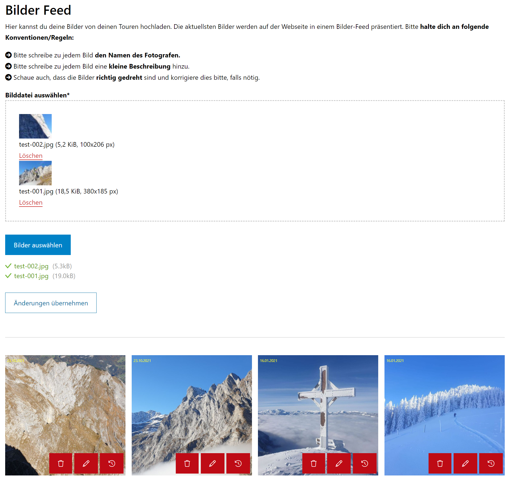

# Member Picture Feed
Benutzer können über ein Frontend-Modul aud ihrem geschützten Bereich ihre Lieblingsbilder hochladen.
Die Bilder können dann über das Contao Galerie Inhaltselement angezeigt werden.

